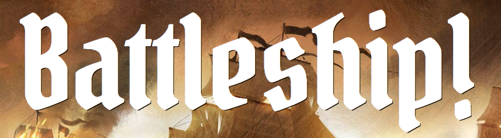

# 

#### By _Quinn Miller, Christopher Cahill, Daniel Burbach, Robert Lee and Ngan Nguyen_

## Description

_This is a simple game of battleship where two players try to sink one another's ships._

## Table of content

- [Installation](#installation)
- [Deploy and Play Game](#to_play)
- [Technology](#technology)
- [License](#license)

## Installation

1. Go to terminal and clone this repository:
```
$ git clone https://github.com/quinnrobepicodus/battle-ships.git
```
2. Change into the project directory and install Gems
```
$ bundle
```
3. Create the Database:
```
$ rails db:create
```
```
$ rails db:migrate
```
4. To run the program:
```
$ rails s
```
6. Go to local host:
```
http://localhost:3000/games
```
## To Play
* Click on New Game button to start game.
* To select placement for your ship, click on the board.
* Once all player's ship are placed, click on Update Game button.
* The game is now in session.
* Click a on the board where you think the opponent's ships might be.
* The computer or player 2 will immediately fire back.
* Repeat until someone wins.

## Technology
* Ruby 2.5.0
* Rails 5
* HTML
* CSS
* PostgreSQL
* Bycrpt

## License
